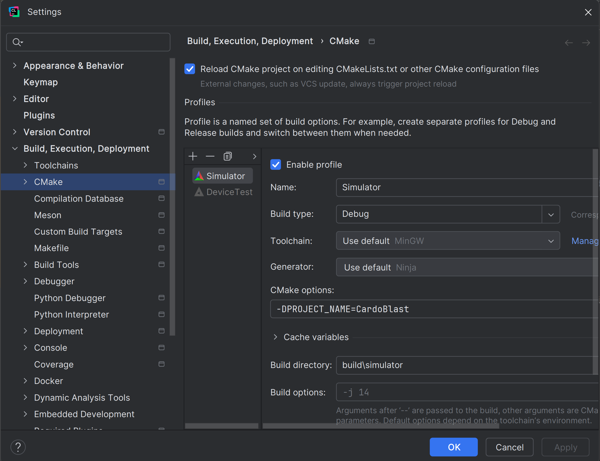
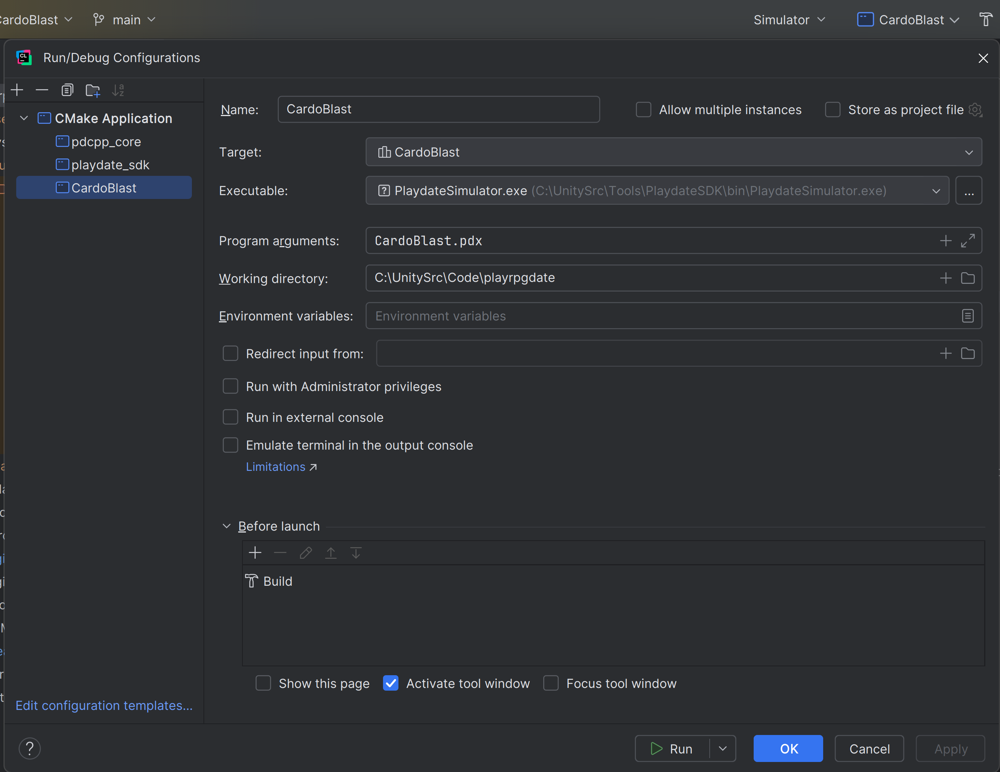

## Pre-requisites
Ensure Playdate SDK v2.6.2 is being used and it set as an environment variable.
```
export PLAYDATE_SDK_PATH="/Users/sergio.prada/Developer/PlaydateSDK/"
```
The download link is [https://download-cdn.panic.com/playdate_sdk/](https://download-cdn.panic.com/playdate_sdk/).
- Why this version? This game depends on [Playdate-cpp](https://github.com/nstbayless/playdate-cpp) which is no longer updated.
- Setting the env SDK path as `/Users/sergio.prada/Developer/PlaydateSDK-2.6.2/` won't work.

## How to build
I work with this either with Terminal or CLion

### Terminal
Add execution permission to bootstrap with chmod +x bootstrap.sh, and launch it. Then choose the option that works for you.

### CLion
1. Open the project in CLion
2. Go to Clion Preferences -> Build, Execution, Deployment -> CMake
3. Add two profiles
    1. "Simulator"
        - Name: Simulator
        - Build type: Debug
        - CMake options: -DPROJECT_NAME=CardoBlast
        - Build directory: <ProjectDir>/build/simulator
    2. "Device"
        - Name: Device
        - Build type: Debug
        - CMake options: -DPROJECT_NAME="CardoBlast" -DCMAKE_TOOLCHAIN_FILE=/Users/sergio.prada/Developer/PlaydateSDK/C_API/buildsupport/arm.cmake
        - Build directory: <ProjectDir>/build/device
4. Open Run/Debug Configurations
5. Add a new configuration
    - Name: CardoBlast
    - Target: CardoBlast
    - Executable: (~/Developer/PlaydateSDK/bin/Playdate Simulator.app/Contents/MacOS/Playdate Simulator)
    - Program arguments: <ProjectDir>/CardoBlast.pdx

#### Screenshot Win/OSX references:


#### Specific Win reference:


#### Specific OSX reference:


## Troubleshooting

### Compiling the game to the device

I'm confused about this problem because sometimes it works and sometimes it doesn't. The general steps I recommend for testing in the device is:

1. `git clean -fdx && git reset --hard`
2. Unlock the playdate and connect it via USB
3. `./bootstrap.sh` -> option 1
4. `./bootstrap.sh` -> option 2
4. Upload to device

It looks like compiling the game twice is necessary.

### Linker Issue on Mac

**Problem Description:**

When compiling, you might encounter a linker error similar to the following:
```
ld: error: .data has both ordered ['.ARM.exidx.text.__aeabi_atexit' ...] and unordered ['.data.__atexit_recursive_mutex' ...] sections.
```

This issue is discussed in detail in this [Playdate Developer Forum thread](https://devforum.play.date/t/cpp-guide-c-on-playdate/5085/39).

**Solution:**

The resolution involves updating to the latest ARM toolchain and creating symbolic links in `/usr/local/bin`. This solution is based on the advice provided in [this forum post](https://devforum.play.date/t/cpp-guide-c-on-playdate/5085/40).

To apply the fix, execute the following command in the Terminal:

```
sudo ln -sf /Applications/ARM/bin/* /usr/local/bin
```
This command creates symbolic links for the ARM toolchain binaries in /usr/local/bin, ensuring that the build process can correctly locate and use these tools.
