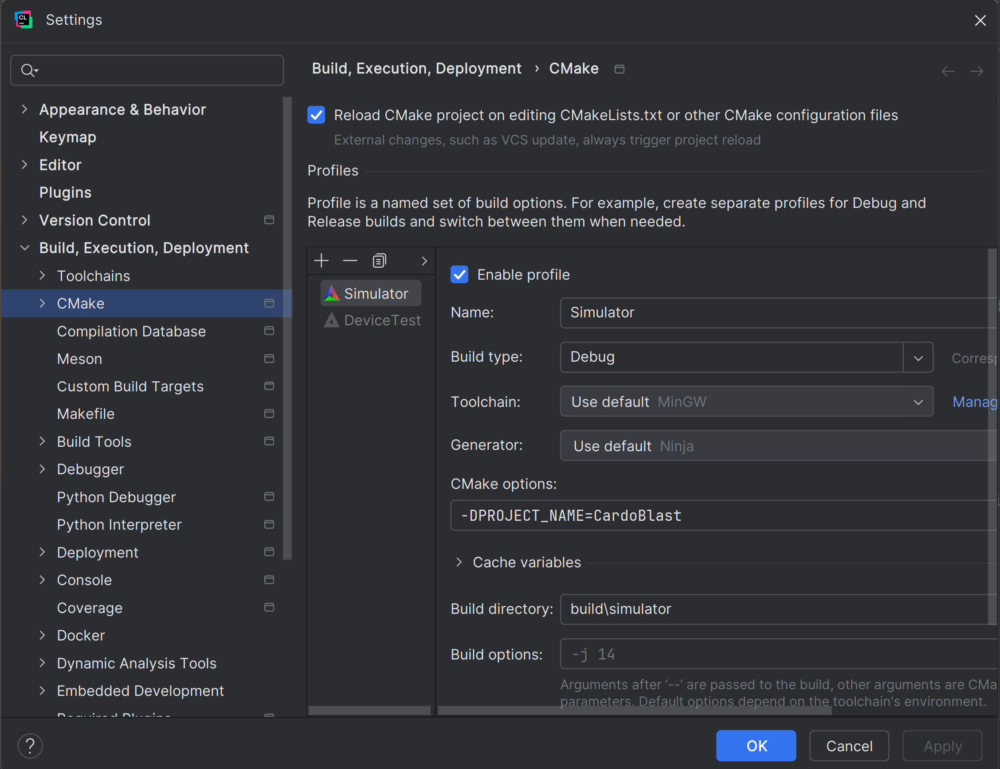
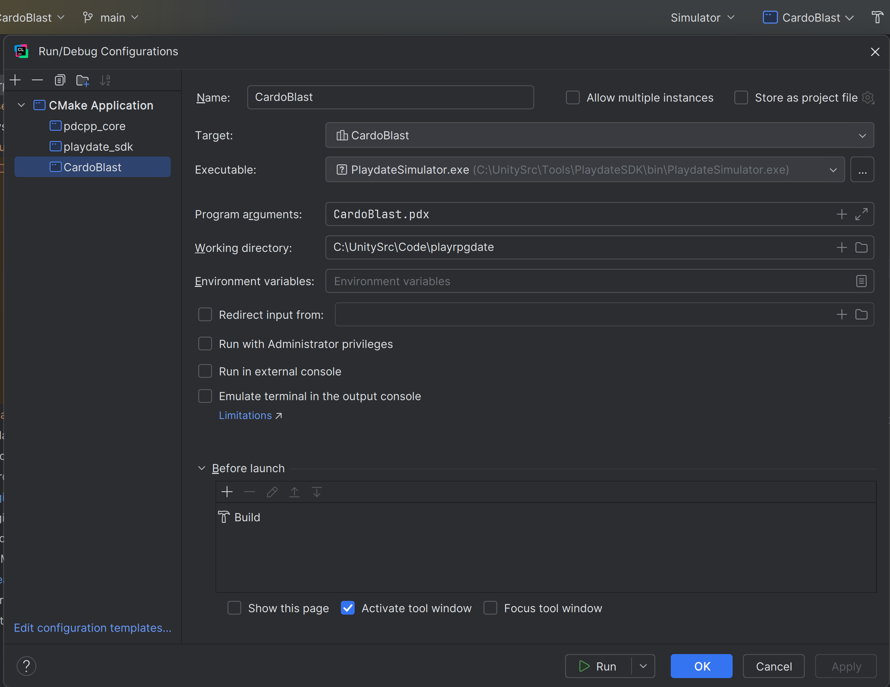

# CardoBlast

Attempting to create an text-based RPG for the playdate using c++.

## How to build
I work with this either with Terminal or CLion

### Terminal
Add execution permission to bootstrap with chmod +x bootstrap.sh, and launch it. Then choose the option that works for you.

### CLion
1. Open the project in CLion
2. Go to Clion Preferences -> Build, Execution, Deployment -> CMake
3. Add two profiles
    1. "Simulator"
        - Name: Simulator
        - Build type: Debug
        - CMake options: -DPROJECT_NAME=CardoBlast
        - Build directory: <ProjectDir>/build/simulator
    2. "Device"
        - Name: Device
        - Build type: Debug
        - CMake options: -DPROJECT_NAME="CardoBlast" -DCMAKE_TOOLCHAIN_FILE=/Users/sergio.prada/Developer/PlaydateSDK/C_API/buildsupport/arm.cmake
        - Build directory: <ProjectDir>/build/device
4. Open Run/Debug Configurations
5. Add a new configuration
    - Name: CardoBlast
    - Target: CardoBlast
    - Executable: (~/Developer/PlaydateSDK/bin/Playdate Simulator.app/Contents/MacOS/Playdate Simulator)
    - Program arguments: <ProjectDir>/CardoBlast.pdx

#### Screenshot Win references:



### Personal Next Steps
Deserialization of Area is going good. I reached the point where I start deserializing the doors
from the area description, but I cannot continue because doors must already been deserialized in
the Entity manager. For clarity:
- In [GameManager](src/GameManager.cpp) I am commanding to deserialize [areas](Source/data/areas.json) first.
- And in [Area](src/Area.cpp) I am stuck at doors mapping in entity manager. line 83.
- So, before that, I must deserialize and add mapping in EntityManager.data;
  - doors in [GameManager](src/GameManager.cpp) line 18.
  - items in [GameManager](src/GameManager.cpp) line 19. Also, armors and weapons?
  - creatures in [GameManager](src/GameManager.cpp) line 20.
  - And areas in the end

Yet, I need to define the ids of everything before continuing. For example:
- IDs in range [100, 200] for items
- IDs in range [200, 300] for armors
- IDs in range [300, 400] for weapons
- IDs in range [400, 500] for creatures
- IDs in range [500, 600] for areas
- IDs in range [600, 700] for doors

## Credits
- [UtilForever RPG](https://github.com/utilForever/SimpleRPG-Text/tree/master).
- [Playdate-cpp](https://github.com/nstbayless/playdate-cpp)
- [Playdate SDK](https://play.date/)
- [JSMN - json parser](https://github.com/zserge/jsmn)

## Disclaimer

This repository incorporates the submodule [playdate-cpp](https://github.com/nstbayless/playdate-cpp). Please refer to its README for guidance on configuration and setup. 

I tested this one:
- Mac M1, running Sonoma 14.15.
- Win 11

## Additional requirements to the official guide
- PLaydate SDK path Environment variable is required!

## Troubleshooting

### Linker Issue on Mac

**Problem Description:**

When compiling, you might encounter a linker error similar to the following:
```
ld: error: .data has both ordered ['.ARM.exidx.text.__aeabi_atexit' ...] and unordered ['.data.__atexit_recursive_mutex' ...] sections.
```

This issue is discussed in detail in this [Playdate Developer Forum thread](https://devforum.play.date/t/cpp-guide-c-on-playdate/5085/39).

**Solution:**

The resolution involves updating to the latest ARM toolchain and creating symbolic links in `/usr/local/bin`. This solution is based on the advice provided in [this forum post](https://devforum.play.date/t/cpp-guide-c-on-playdate/5085/40).

To apply the fix, execute the following command in the Terminal:

```
sudo ln -sf /Applications/ARM/bin/* /usr/local/bin
```
This command creates symbolic links for the ARM toolchain binaries in /usr/local/bin, ensuring that the build process can correctly locate and use these tools.
